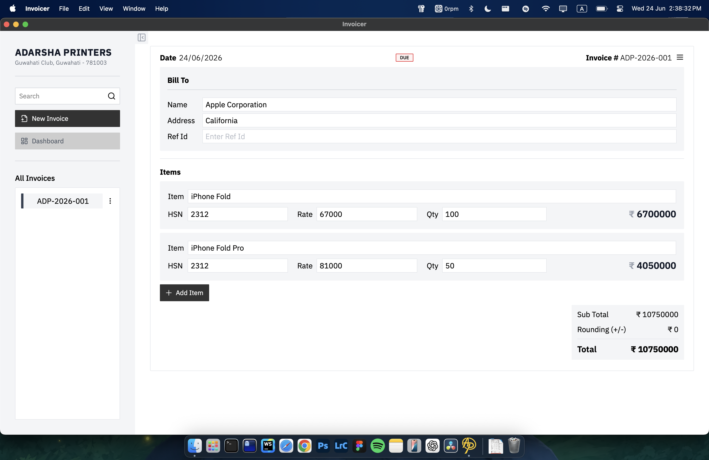
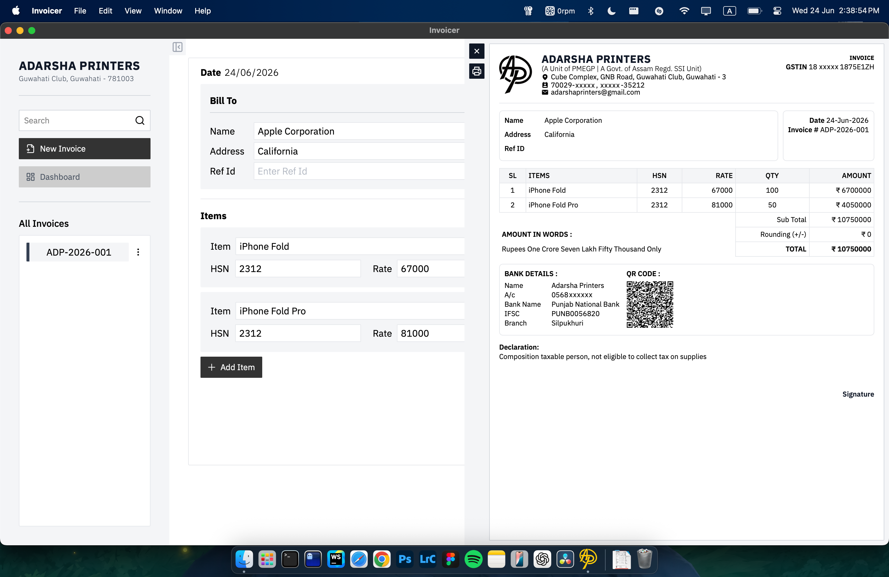

# Invoicer




A lightweight desktop invoicing application built with **React, TypeScript, Rust, and Tauri**.  
The goal of this project was to design and build a **real-world, offline-first desktop application** that solves an actual business workflow: generating printable invoices quickly and reliably.

This project was built for real usage in a small business environment where reliability, simplicity, and performance matter more than complexity.

---

# Motivation

Most invoicing tools today are:

- Web-only
- Subscription-based
- Overly complex for small businesses

This project explores a different approach:

- **Offline-first**
- **Fast native desktop performance**
- **Small install size (~15MB instead of ~200MB typical Electron apps)**
- **Simple workflow optimized for invoice creation**

The application is designed for **single-user local usage**, prioritizing speed and usability.

---

# Tech Stack

### Frontend

- React
- TypeScript
- Vite
- TailwindCSS

### Desktop Runtime

- Tauri

### Backend

- Rust

### Database

- SQLite (via Rust)

### Packaging

- macOS `.dmg`
- Windows `.msi`

---

# Key Features

- Create invoices quickly with minimal friction
- Dynamic invoice item management
- Automatic invoice ID generation
- Local SQLite database storage
- Search invoices
- Printable invoices
- Cross-platform desktop builds

---

# Architecture

The application follows a **desktop hybrid architecture**.

```
React UI
   ↓
Tauri bridge
   ↓
Rust commands
   ↓
SQLite database
```

### Frontend responsibilities

- UI rendering
- state management
- user interaction
- printing layout

### Rust backend responsibilities

- database access
- persistent storage
- system-level operations

This separation keeps the UI responsive while allowing safe local database access.

---

# Development Process

This project was intentionally built **from scratch without scaffolding heavy frameworks** in order to understand the underlying mechanics of:

- state management
- desktop app architecture
- database persistence
- printing and pagination
- cross-platform packaging

Key development decisions:

### 1. Tauri instead of Electron

Electron bundles Chromium which results in large binaries (~200MB+).  
Tauri uses the system webview and compiles Rust to a native binary.

Result:

```
Electron app ≈ 200MB+
Tauri app ≈ 10–15MB
```

### 2. Offline-first architecture

All data is stored locally using SQLite.  
No internet connection is required.

### 3. Simplicity over abstraction

The application intentionally avoids large state libraries and unnecessary abstraction layers.

---

# Interesting Engineering Problems Solved

### Multi-page printable invoices

Implemented CSS print layouts capable of handling:

- page overflow
- repeating table headers
- proper A4 sizing

### Invoice ID generation

IDs follow a format:

```
ADP-YYYY-001
```

The system reads the latest invoice and generates the next sequential ID automatically.

### Desktop packaging

The app compiles into:

- macOS `.dmg`
- Windows `.msi`

---

# Example Workflow

1. Create new invoice
2. Add customer details
3. Add items dynamically
4. Print invoice
5. Invoice is saved locally

---

# Project Goals

This project focuses on demonstrating:

- full stack desktop development
- system design thinking
- practical problem solving
- clean architecture
- real-world usability

---

# Future Improvements

Planned enhancements include:

- PDF export
- automatic database backup
- improved invoice search
- keyboard shortcut support
- native menu integration

---

# Author

Built by **Isfaqul** as part of a journey toward becoming a professional full-stack developer.

The project reflects a focus on **building real software instead of tutorial projects**, emphasizing practical engineering skills.
